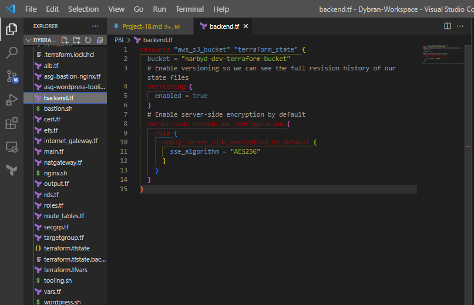
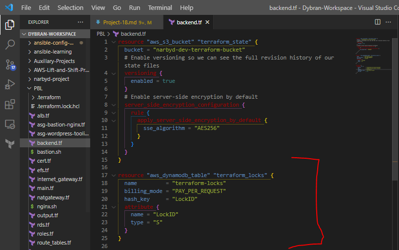

## __USING TERRAFORM IAC TOOL TO AUTOMATE AWS CLOUD SOLUTION FOR 2 COMPANY WEBSITES (REFACTORING) - CONTINUATION__

In two previous projects you have developed AWS Infrastructure code using Terraform and tried to run it from our local workstation.
Now it is time to introduce some more advanced concepts and enhance the code.

Firstly, we will explore alternative Terraform __backends__. A backend defines where Terraform stores its state data files - __terraform.tfstate__ file.

Terraform uses persisted state data to keep track of the resources it manages. Most non-trivial Terraform configurations either integrate with Terraform Cloud or use a backend to store state remotely. This lets multiple people access the state data and work together on that collection of infrastructure resources.

## __Introducing Backend on S3__

So far in this project, we have been using the default backend which is the local backend – it requires no configuration and the states file is stored locally. This mode is not a robust solution, so it is better to store it in some more reliable and durable storage.

The problem with storing this file locally is that, in a team of multiple DevOps engineers, other engineers will not have access to a state file stored locally on your computer.

To solve this, we will need to configure a backend where the state file can be accessed remotely by other DevOps team members. There are plenty of different standard backends supported by Terraform that you can choose from. Since we are already using AWS – we can choose an __S3 bucket__ as a backend.

Another useful option that is supported by S3 backend is [State Locking](https://developer.hashicorp.com/terraform/language/state/locking) – it is used to lock your state file for all operations that could write state. This prevents others from acquiring the lock and potentially corrupting your state. State Locking feature for S3 backend is optional and requires another AWS service – [DynamoDB](https://aws.amazon.com/dynamodb).

We will be refactoring our codes to use __modules__ and move the __terraform.tfstate__ file to the __S3 bucket__ in the cloud.

__Modules__ serve as containers that allow to logically group Terraform codes for similar resources in the same domain (e.g., Compute, Networking, AMI, etc.). One __root module__ can call other child modules and insert their configurations when applying Terraform config. This concept makes the code structure neater, and it allows different team members to work on different parts of configuration at the same time.

First we create a directory named  __narbyd-project__ which will be the __root-modules__ inside the __root-module__ we create a directory named __modules__. 

`$ mkdir narbyd-project && cd narbyd-project`

`$ mkdir modules`

Inside the  __modules__ directory, we create the directories that will hold the diiferent resources eg __ALB, VPC, ASG, SECGRP, RDS, EFS__ and also the __compute__ directory.

Copy the files containing the resources that was created in __PROJECT-17__ into each of the folders created as related to the resources.

In the __root-module__ create a file __main.tf__, __provider.tf__, __terraform.tfvars__, __vars.tf__ file.

__The refactored code can be found [here](https://github.com/dybran/Project-18/tree/main/narbyd-project).__

Then run the commands

`$ terraform init`

`$ terraform validate`

`$ terraform fmt`


The steps to Re-initialize Terraform to use S3 backend:

- Add S3 and DynamoDB resource blocks before deleting the local state file
- Update terraform block to introduce backend and locking
- Re-initialize terraform
- Delete the local tfstate file and check the one in S3 bucket
- Add outputs
- terraform apply

Create a file and name it __backend.tf__. Add the below code and replace the name of the S3 bucket we created earlier.

```
resource "aws_s3_bucket" "terraform_state" {
  bucket = "narbyd-dev-terraform-bucket"
  # Enable versioning so we can see the full revision history of our state files
  versioning {
    enabled = true
  }
  # Enable server-side encryption by default
  server_side_encryption_configuration {
    rule {
      apply_server_side_encryption_by_default {
        sse_algorithm = "AES256"
      }
    }
  }
}
```


Terraform stores Passwords and secret keys processed by resources in the state files. Hence, we should enable encryption with __server_side_encryption_configuration__ in the above code.

Next, we will create a__ DynamoDB__ table to handle locks and perform consistency checks. In previous projects, locks were handled with a local file as shown in __terraform.tfstate.lock.info__. Since we now have a team mindset, causing us to configure S3 as our backend to store state file, we will do the same to handle locking. Therefore we will use a cloud storage database like DynamoDB so that anyone running Terraform against the same infrastructure can use a central location to control a situation where Terraform is running at the same time from multiple different people.

Dynamo DB resource for locking and consistency checking:

```
resource "aws_dynamodb_table" "terraform_locks" {
  name         = "terraform-locks"
  billing_mode = "PAY_PER_REQUEST"
  hash_key     = "LockID"
  attribute {
    name = "LockID"
    type = "S"
  }
}
```


Terraform expects that both S3 bucket and DynamoDB resources are already created before we configure the backend. So, let us run terraform apply to provision resources.

Configure S3 Backend

```
terraform {
  backend "s3" {
    bucket         = "narbyd-dev-terraform-bucket"
    key            = "global/s3/terraform.tfstate"
    region         = "us-east-1"
    dynamodb_table = "terraform-locks"
    encrypt        = true
  }
}
```


Run 

`$ terraform init`

Confirm you are happy to change the backend by typing __yes__
